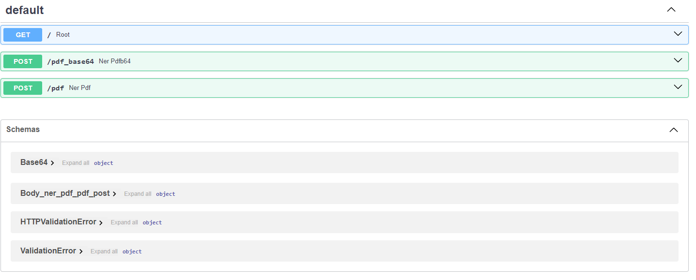
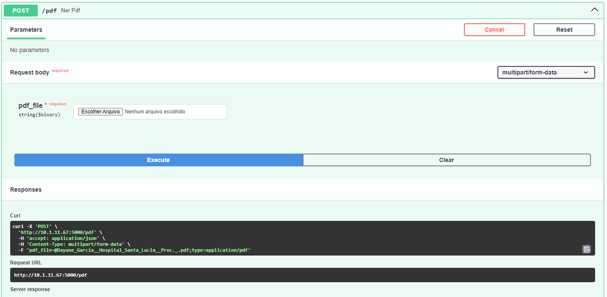

# Aplicativo de Extração de Entidades Nomeadas (NER) em PDF

Este é um aplicativo Python para extração de Entidades Nomeadas (NER) de um arquivo PDF enviado em formato Base64. Ele usa o framework FastAPI e a biblioteca Spacy para realizar essa tarefa.

## Como executar o aplicativo

Siga as instruções abaixo para executar o aplicativo em sua máquina local.

### Pré-requisitos

Certifique-se de ter instalado o Python em sua máquina. Além disso, você precisará instalar as seguintes bibliotecas Python:

- spacy
- fastapi
- uvicorn
- pydantic
- python-dotenv
- PyMuPDF

Você pode instalar as bibliotecas executando o seguinte comando:

```
pip install -r requirements.txt
```

### Configuração

Antes de executar o aplicativo, você precisa configurar algumas variáveis de ambiente. Renomeie o arquivo chamado `EXAMPLE.env` e adicione as seguintes descrições das variáveis:

```python
TITLE='exemplo_de_titulo'
DESCRIPTION='exemplo_de_descricao'
```

Além disso, você deve substituir o modelo spaCy `lener` usado para NER por `pt_core_news_lg` ou qualquer outro modelo spaCy adequado., visto que o `lener` é um modelo próprio (customizado pela equipe).

### Executando o aplicativo

As configurações do `uvicorn` estão determinadas dentro do script `app.py` para auto-execução, conforme mostrado abaixo:

```python
if __name__ == "__main__":

    uvicorn.run("app:app", host="0.0.0.0", port=5000, reload=True)
```

Isso significa que, ao rodar o código,  ele ficará acessível por toda rede local (LAN) através da porta 5000, podendo ser acessado, por exemplo, por ``http://192.168.0.1:5000/docs`` 

Dessa forma, para rodar o código, acesse o diretório do projeto e execute apenas o comando:

```python
python app.py
```


Você pode também acessar o diretório do projeto e executar o seguinte comando:

```
uvicorn app:app --reload
```

Porém, é necessário remover do script ``app.py`` o trecho:

```python
if __name__ == "__main__":

    uvicorn.run("app:app", host="0.0.0.0", port=5000, reload=True)
```

Isso iniciará o aplicativo na máquina local, em `http://localhost:5000`.

Você poderá acessar a documentação interativa do aplicativo em `http://localhost:5000/docs`.

## Uso do aplicativo

O aplicativo possui uma rota POST `/pdf_base64` que permite enviar um arquivo PDF em formato Base64 para extração de entidades nomeadas.

### Exemplo de solicitação

Para enviar um arquivo PDF, você precisará codificar o arquivo em formato Base64. Em seguida, faça uma solicitação POST para `http://localhost:5000/pdf_base64` com o seguinte payload:

```json
{
  "pdf_base64": "<base64_encoded_pdf>"
}
```

Substitua `<base64_encoded_pdf>` pelos dados do arquivo PDF codificados em formato Base64.

### Exemplo de resposta

A resposta será um objeto JSON contendo as entidades nomeadas extraídas do arquivo PDF. Aqui está um exemplo de resposta:

```json
{
  "pessoas": [
    "John Doe",
    "Jane Smith",
    "Mike Johnson"
  ]
}
```

## Swagger

O aplicativo possui uma documentação interativa gerada automaticamente pelo Swagger. Você pode acessar a documentação em `http://localhost:5000/docs`.






## Considerações finais

Este é um aplicativo simples para extrair entidades nomeadas de arquivos PDF. Sinta-se à vontade para utilizar, modificar e melhorar o código conforme necessário.

